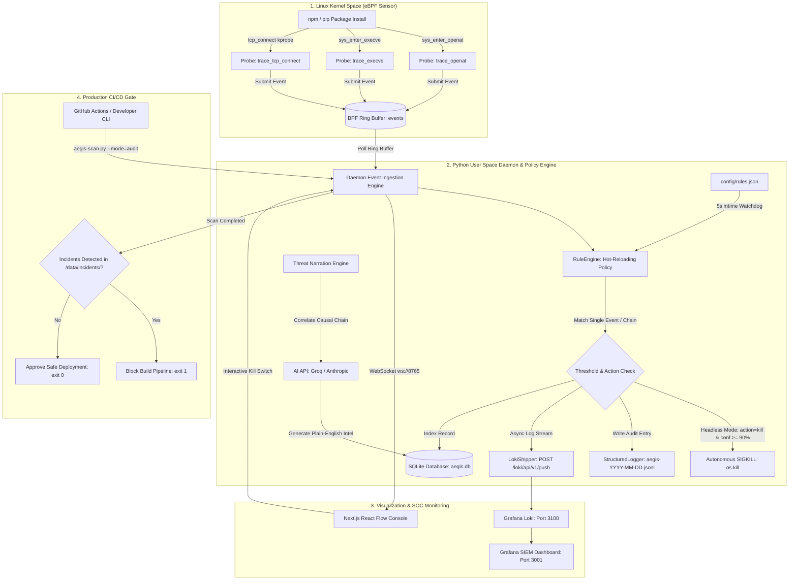

# 🛡️ AELFRA AEGIS — COMPLETE MASTER BLUEPRINT & SYSTEM ARCHITECTURE

> **The Definitive Industry Guide to Kernel-Level Software Supply Chain Defense**  
> *Author: Umar Ahmed*  
> *Version: 1.0.0 (Production / Industry-Ready)*  
> *Live Console: [https://aelfra-aegis.vercel.app/](https://aelfra-aegis.vercel.app/)*  
> *Repository: [https://github.com/mr-umar-ahmed/Aelfra-Aegis](https://github.com/mr-umar-ahmed/Aelfra-Aegis)*

---

## 📑 Table of Contents

1. [Executive Summary & Problem Statement](#1-executive-summary--problem-statement)
2. [What is Aelfra Aegis? (Our Solution)](#2-what-is-aelfra-aegis-our-solution)
3. [Complete Technology Stack & Languages](#3-complete-technology-stack--languages)
4. [Competitive Advantage: Why Aegis is Better Than Alternatives](#4-competitive-advantage-why-aegis-is-better-than-alternatives)
5. [End-to-End System Architecture](#5-end-to-end-system-architecture)
6. [Comprehensive Feature Breakdown (Every Single Feature)](#6-comprehensive-feature-breakdown-every-single-feature)
7. [Industry Readiness: How Enterprises & DevSecOps Teams Use Aegis](#7-industry-readiness-how-enterprises--devsecops-teams-use-aegis)
8. [Complete Step-by-Step Execution Guide](#8-complete-step-by-step-execution-guide)
9. [Technical Interview Deep-Dives & FAQs](#9-technical-interview-deep-dives--faqs)

---

## 1. Executive Summary & Problem Statement

### The Critical Vulnerability in Modern Software Development
Modern software applications are built by composing open-source dependencies. An average Node.js or Python application imports hundreds or thousands of third-party packages from registries like **npm** and **PyPI**.

When an engineer or a CI/CD pipeline runs:
```bash
npm install <package>
# or
pip install <package>
```
The package manager automatically executes arbitrary lifecycle scripts (such as `preinstall`, `install`, and `postinstall` hooks in `package.json`, or `setup.py` in Python). **These scripts run with full user/root privileges directly on the host or build runner.**

### Why Existing Security Tools Fail (The Detection Gap)
Industry standard security scanners (e.g., **Snyk, Dependabot, Trivy, `npm audit`**) are **static lockfile scanners**. They operate by matching package names and version strings in `package-lock.json` against known CVE databases (NVD).

| Attack Category | Static Scanners (Snyk / Dependabot / npm audit) | Real-World Impact |
| :--- | :--- | :--- |
| **Zero-Day Malicious Packages** | ❌ **Blind** (No CVE exists yet) | Attacker publishes malicious package; it executes immediately upon install. |
| **Typosquatting (`lodsh` vs `lodash`)** | ❌ **Blind** (It is a valid, clean-looking package with no known vulnerability) | Developer mistypes package name; attacker script runs during install. |
| **Account Takeover / Maintainer Hijacking** | ❌ **Blind** (Version bump is clean in database) | Compromised maintainer pushes legitimate-looking version containing credential stealer (e.g., *ua-parser-js*, *event-stream*). |
| **Dynamic Obfuscated Payloads** | ❌ **Blind** (Code is base64/eval encrypted) | Static AST parsers cannot resolve dynamic runtime execution. |
| **Real-time Runtime Blocking** | ❌ **None** (Static tools only alert after the fact) | Secret keys are stolen and exfiltrated in under **500 milliseconds**. |

### The Real-World Supply Chain Attack Chain
1. Developer / CI runner executes `npm install evil-pkg`.
2. `postinstall` script runs inside `node`.
3. `node` opens `../../.env` or `~/.aws/credentials` to harvest AWS access keys, database passwords, and API tokens.
4. `node` initiates an outbound HTTP POST connection to an attacker-controlled Command & Control (C2) server.
5. `node` spawns `/bin/bash -c "id"` to verify remote shell execution capabilities.
6. **Result:** Secrets are stolen, infrastructure compromised, zero CVEs triggered.

---

## 2. What is Aelfra Aegis? (Our Solution)

**Aelfra Aegis** is a **kernel-level runtime intrusion detection and autonomous defense system** purpose-built to intercept, trace, and block software supply chain attacks in real-time.

Instead of inspecting static text files, Aegis hooks directly into the **Linux Kernel** using **eBPF (Extended Berkeley Packet Filter)** probes. It intercepts the fundamental system calls that an attacker *must* execute to cause harm:
- **`openat`**: Flags unauthorized reads to sensitive secret files (`.env`, AWS keys, SSH private keys).
- **`execve`**: Flags unexpected child processes and reverse shells spawned by package managers (`bash`, `sh`, `nc`, `curl`).
- **`tcp_connect`**: Tracks unauthorized outbound network sockets and correlates destination IPs against threat databases.

### Core Capabilities:
1. **Zero-Overhead Kernel Interception**: eBPF bytecode executes in kernel space with `< 1% CPU overhead`.
2. **Temporal Causal Provenance**: Reconstructs the exact parent-child process tree (`npm` → `node` → `bash` → `network`).
3. **Hot-Reloading JSON Policy Engine**: Configurable MITRE ATT&CK rules (`config/rules.json`) reloaded dynamically without daemon restarts.
4. **Autonomous Headless Blocking**: Kills malicious process trees via `SIGKILL` in `< 50ms` in CI/CD pipelines without human intervention.
5. **Interactive Provenance Console**: Visualizes live execution graphs on a responsive Next.js React Flow dashboard.
6. **Enterprise SIEM Integration**: Ships unbuffered JSON Lines (`.jsonl`) logs and streams directly to Grafana Loki.
7. **AI-Powered Threat Narration**: Leverages LLMs to generate technical 3-sentence incident summaries for SOC analysts.

---

## 3. Complete Technology Stack & Languages

```text
┌─────────────────────────────────────────────────────────────────────────┐
│                           AELFRA AEGIS TECH STACK                       │
├───────────────────┬────────────────────────────┬────────────────────────┤
│ Layer             │ Technologies / Libraries   │ Purpose                │
├───────────────────┼────────────────────────────┼────────────────────────┤
│ Kernel Space      │ C, eBPF Bytecode, BPF Maps │ Low-level syscall      │
│ (Sensor Engine)   │ Linux Tracepoints, kprobes │ interception & ring    │
│                   │ libbpf / CO-RE, BTF        │ buffer submission      │
├───────────────────┼────────────────────────────┼────────────────────────┤
│ User Space Daemon │ Python 3.11, BCC, ctypes   │ Ring buffer polling,   │
│ & Policy Engine   │ SQLite3, ipaddress, socket │ event enrichment,      │
│                   │ watchdog, argparse, signal │ autonomous SIGKILL     │
├───────────────────┼────────────────────────────┼────────────────────────┤
│ SIEM & Telemetry  │ JSON Lines (JSONL), Loki   │ Enterprise logging,    │
│ Stack             │ Grafana 10.2, Docker       │ unbuffered audit trails│
│                   │ Docker Compose, LogQL      │ metric time-series     │
├───────────────────┼────────────────────────────┼────────────────────────┤
│ Frontend Web      │ Next.js 14 (App Router)    │ Interactive temporal   │
│ Console           │ TypeScript, React 18       │ provenance graph,      │
│                   │ @xyflow/react (React Flow) │ mobile responsive UI,  │
│                   │ TailwindCSS, Lucide Icons  │ threat intelligence    │
├───────────────────┼────────────────────────────┼────────────────────────┤
│ Intelligence & IPC│ WebSockets (ws://8765)     │ Real-time UI bridge,   │
│ Integrations      │ Groq API (LLaMA 3.1 70B)   │ AI threat narration,   │
│                   │ AbuseIPDB REST API v2      │ C2 reputation scoring  │
├───────────────────┼────────────────────────────┼────────────────────────┤
│ CI/CD & Testing   │ GitHub Actions, Docker     │ Automated build gate,  │
│                   │ Bash Test Harness          │ container isolation    │
└───────────────────┴────────────────────────────┴────────────────────────┘
```

---

## 4. Competitive Advantage: Why Aegis is Better Than Alternatives

| Feature / Metric | Aelfra Aegis | Falco (Sysdig) | Tracee (Aqua Security) | Snyk / Dependabot |
| :--- | :--- | :--- | :--- | :--- |
| **Primary Focus** | **Software Supply Chain Attacks** | Generic Container Security | Generic Linux Tracing | Static CVE Database |
| **Detection Timing** | **Real-Time Runtime (< 1ms)** | Real-Time Runtime | Real-Time Runtime | Pre-Build Static Only |
| **Visualization** | **Interactive React Flow Graph** | CLI / 3rd Party UI | CLI / Terminal Output | Static Web Dashboard |
| **Process Tree Provenance**| **Full Temporal Parent-Child Graph**| Text Logs | Text Logs | None |
| **Autonomous Action** | **Sub-50ms Headless SIGKILL** | Requires Sidekick plugins | Requires external agent | Passive Alert Only |
| **Configuration Format** | **Declarative Hot-Reloading JSON** | Static YAML Rules | Rego / Go Signatures | Fixed Rule Database |
| **AI Threat Narration** | **Built-in (3-sentence LLM narrative)**| None | None | None |
| **SIEM Compatibility** | **Native JSONL + Grafana Loki Stack** | Syslog / Webhook | JSON stdout | Proprietary API |
| **Mobile Experience** | **100% Mobile Responsive Console** | None | None | Web Dashboard |
| **Kernel Overhead** | **< 1% CPU (Ring Buffer)** | ~1.5–3% CPU | ~2% CPU | 0% (Offline) |
| **Cost** | **100% Free & Open Source** | Open Source / Paid Cloud | Open Source / Paid Cloud | Commercial Tier |

---

## 5. End-to-End System Architecture



---

## 6. Comprehensive Feature Breakdown (Every Single Feature)

### 1. Kernel-Level Syscall Sensor (`sensor/aegis.bpf.c` & `ebpf/probes.c`)
- Attaches to tracepoints: `tracepoint/syscalls/sys_enter_openat` and `tracepoint/syscalls/sys_enter_execve`.
- Attaches to kprobes: `kprobe/tcp_connect` for TCP socket connection monitoring.
- Uses **BPF Ring Buffer** (`BPF_MAP_TYPE_RINGBUF`) which provides unified memory sharing across all CPU cores, zero memory fragmentation, and lockless multi-producer single-consumer ring buffering.

### 2. Hot-Reloading JSON Policy Rule Engine (`daemon/rule_engine.py` & `config/rules.json`)
- **Declarative Detection Policies**:
  - `CRED_001` (T1552.001): Credential File Access (`.env`, `.aws/credentials`, `id_rsa`, `token.json`, `secrets.json`).
  - `EXEC_001` (T1059.004): Suspicious Child Process Execution from Package Manager (`npm`/`pip`/`node` spawning `bash`, `sh`, `nc`, `curl`).
  - `NET_001` (T1071.001): Unexpected Outbound Network Connection from Install Process on non-standard ports.
  - `CHAIN_001` (T1020): Full Credential Exfiltration Chain (File access followed by Network socket from same PID within 30 seconds).
- **Background Watchdog**: Checks `os.stat().st_mtime` every 5 seconds. Rules can be updated on production servers without restarting the daemon.

### 3. Three Operating Modes (`--mode=interactive|headless|audit`)
- **`--mode=interactive` (Default)**: Runs WebSocket bridge on `ws://0.0.0.0:8765`, streaming live telemetry to the Next.js React Flow dashboard for human-in-the-loop SOC triage.
- **`--mode=headless` (Autonomous Pipeline Guard)**: Autonomous threat blocker. Automatically issues `os.kill(pid, signal.SIGKILL)` when confidence exceeds threshold (default: `90%`). Generates incident reports in `/data/incidents/AGS-YYYY-XXX.json`.
- **`--mode=audit` (Passive Compliance Logging)**: CI-safe logging mode. Never issues SIGKILL; logs all rule matches to `/data/audit/*.jsonl` and stdout.

### 4. SIEM-Compatible Structured Logger (`daemon/structured_logger.py`)
- Emits self-contained **JSON Lines (JSONL)** to `/data/audit/aegis-YYYY-MM-DD.jsonl`.
- **Zero-Cron Daily UTC Rotation**: Derives log paths dynamically at write time; rotates automatically at `00:00:00 UTC`.
- **Unbuffered Immediate Flushing**: Executes `f.flush()` after every write, ensuring audit trails survive process termination or crashes.
- **MITRE ATT&CK Taxonomy**: Enriches records with Technique IDs (`T1552.001`, `T1059.004`, `T1071.001`, `T1020`, etc.) and Tactics (*Credential Access*, *Execution*, *Command and Control*, *Exfiltration*).

### 5. Local Enterprise Monitoring Stack (`monitoring/docker-compose.yml`)
- **Grafana Loki (`:3100`)**: Lightweight, high-throughput log aggregation indexing stream labels.
- **Grafana (`:3001`)**: Pre-provisioned visual console with anonymous Admin access.
- **`LokiShipper` (`daemon/loki_shipper.py`)**: Asynchronous, non-blocking queue streaming nanosecond-timestamped records (`int(time.time() * 1e9)`) to Loki.
- **Pre-Built SIEM Dashboard Panels**:
  1. *Events Over Time* (Timeseries rate graph).
  2. *Critical Events* (Tabular view of critical alerts).
  3. *MITRE ATT&CK Techniques* (Horizontal bar chart aggregation).
  4. *Recent Events* (Live LogQL streaming logs).

### 6. Interactive Temporal Provenance Console (`dashboard/`)
- **React Flow Provenance Graph**: Renders live process trees where nodes represent OS processes (`pid`, `comm`, `attack_type`, `severity`) and edges represent syscall actions (`file read`, `exec spawn`, `tcp_connect`).
- **Interactive Kill Switch**: Dispatches `{"action":"kill","pid":<PID>}` over WebSocket to terminate compromised threads.
- **Spacious 4-Column Layout**: Left Sidebar (~240px), Full-Height Graph Canvas, Dedicated Behavioral Threat Intelligence Column (~340px), and Live Event Stream (~280px).
- **100% Mobile Responsive Architecture**: Features a 1-tap mobile navigation switcher (`🎨 GRAPH`, `⚠️ THREATS`, `⚡ EVENTS`, `📋 MENU`) with touch pan & pinch-to-zoom controls.
- **Interactive In-Browser Simulator**: Allows users to test attack scenarios (`Typosquatting`, `.env Credential Theft`, `Reverse Shell`, `Full Chain`) directly in the browser without local root daemon setup.

### 7. AI Threat Narration Engine
- Captures raw syscall arrays and sends structured prompts to Groq / Anthropic APIs.
- Returns crisp, 3-sentence technical summaries explaining what happened, the attacker's intent, and the corresponding threat family.

### 8. Syscall Baseline Anomaly Scoring
- Mapped against baseline profiles of 10 clean npm packages (`express`, `lodash`, `chalk`, `react`, etc.).
- Computes composite risk score (0–100) and displays anomaly indicators on an SVG dashboard gauge.

### 9. SQLite Persistence & Incident Export (`lib/export.ts`)
- Persistent event indexing in `/data/aegis.db`.
- One-click client-side export generating downloadable, self-contained HTML incident reports with full attack timelines.

### 10. Production CI/CD Gate & CLI Scanner (`cli/aegis-scan.py`)
- Standalone CLI scanner that runs dependency installation in isolated Docker containers while monitoring kernel syscalls.
- GitHub Actions workflow (`.github/workflows/aegis-scan.yml`) automatically blocks PRs and commits containing malicious postinstall scripts.

### 11. libbpf / CO-RE Proof-of-Concept (`sensor/libbpf/`)
- Demonstrates **Compile Once — Run Everywhere (CO-RE)** using kernel BTF metadata (`vmlinux.h`).
- Ahead-Of-Time (AOT) compilation to a portable `.bpf.o` binary using Clang without runtime host compiler dependencies.

---

## 7. Industry Readiness: How Enterprises & DevSecOps Teams Use Aegis

Aegis is architected to fit seamlessly into enterprise security workflows at three distinct inspection boundaries:

```text
┌────────────────────────────────────────────────────────────────────────┐
│               ENTERPRISE INTEGRATION BOUNDARIES                        │
├──────────────────────────┬─────────────────────────────────────────────┤
│ 1. Developer Workstation │ Interactive UI or CLI pre-install checks    │
│    (Local Development)   │ Blocks typosquats before code is written    │
├──────────────────────────┼─────────────────────────────────────────────┤
│ 2. CI/CD Build Pipelines │ Headless Gate: GitHub Actions / GitLab CI   │
│    (Automated Testing)   │ Blocks builds with non-zero exit codes      │
├──────────────────────────┼─────────────────────────────────────────────┤
│ 3. Production Servers &  │ Audit Mode + Grafana/Loki / Splunk stream   │
│    Kubernetes Clusters   │ Continuous compliance monitoring & SOC alert│
└──────────────────────────┴─────────────────────────────────────────────┘
```

### 1. Automated CI/CD Dependency Gate
In enterprise CI/CD pipelines, Aegis runs in `--mode=audit` inside containerized build steps. When dependencies are installed:
- If a postinstall script attempts to access `.env` or spawn a shell, Aegis writes an incident file.
- The pipeline checks `/data/incidents/`, detects the threat, fails the build (`exit 1`), and uploads the JSONL audit trail as an artifact.
- **No compromised build ever reaches production artifact registries.**

### 2. Security Operations Center (SOC) & SIEM Ingestion
- In enterprise staging and production environments, Aegis streams all kernel events to Grafana Loki or enterprise SIEMs (Splunk, Elastic, Datadog).
- SOC analysts view unified dashboards tracking MITRE techniques, anomalous package installations, and outbound network exfiltrations.

### 3. Developer Desktop Security
- Developers running Aegis locally get instant interactive alerts and 1-click process termination whenever an untrusted open-source package is tested.

---

## 8. Complete Step-by-Step Execution Guide

### Prerequisite Check
- **OS**: Linux (Ubuntu 22.04 LTS recommended) with kernel 5.15+ for eBPF; or Windows/macOS for Next.js UI & in-browser simulator.
- **Tools**: Python 3.10+, Node.js 18+, Docker (optional for isolated container scans).

---

### Step 1: Clone & Setup Environment
```bash
git clone https://github.com/mr-umar-ahmed/Aelfra-Aegis.git
cd Aelfra-Aegis

# Copy environment template
cp .env.example .env
```

---

### Step 2: Launch the Next.js Dashboard Console
```bash
cd dashboard
npm install
npm run dev
```
Open **[http://localhost:3000](http://localhost:3000)** (or visit the live deployment at **[https://aelfra-aegis.vercel.app/](https://aelfra-aegis.vercel.app/)**).

---

### Step 3: Run the eBPF Security Daemon (Linux)

#### Option A: Interactive Mode (WebSocket UI Bridge)
```bash
sudo python3 daemon/daemon.py --mode=interactive
```

#### Option B: Autonomous Headless Mode (Auto-Kill >= 90% Confidence)
```bash
sudo python3 daemon/daemon.py --mode=headless --threshold=90
```

#### Option C: Audit Mode (Passive SIEM Logging)
```bash
sudo python3 daemon/daemon.py --mode=audit
```

*(Note: On Windows/macOS, running `python daemon/daemon.py` automatically activates Mock Event Mode for UI validation).*

---

### Step 4: Run the Supply Chain Attack Simulator
Open a separate terminal and run the simulated attack scenarios:

#### Scenario 1: .env Credential Theft & Exfiltration
```bash
# Terminal 1: Start mock C2 exfil listener
python3 simulator/listener.py

# Terminal 2: Trigger malicious package install
cd simulator/target-app
npm install --foreground-scripts
```

#### Scenario 2: Reverse Shell Spawn
```bash
cd simulator/attacks/reverse-shell
npm install --foreground-scripts
```

#### Scenario 3: Cryptominer Loop
```bash
cd simulator/attacks/cryptominer
npm install --foreground-scripts
```

---

### Step 5: Start the Grafana + Loki Monitoring Stack
```bash
cd monitoring
docker compose up -d
```
- Open Grafana at **[http://localhost:3001](http://localhost:3001)** (Anonymous Admin access pre-configured).
- View real-time LogQL graphs, MITRE ATT&CK technique breakdowns, and critical alert feeds.

---

### Step 6: Verify SIEM Audit Logs
Inspect and validate the SIEM-compatible JSONL logs:
```bash
python3 scripts/verify-logs.py
```

---

### Step 7: Run the Standalone CLI Scanner
Scan any `package.json` or `requirements.txt` manifest:
```bash
python3 cli/aegis-scan.py package.json
```

---

### Step 8: Build the libbpf CO-RE Kernel Sensor
```bash
cd sensor/libbpf
chmod +x setup.sh
./setup.sh
```

---

## 9. Technical Interview Deep-Dives & FAQs

#### Q1: Why hook `sys_enter_openat` instead of `sys_enter_read`?
> **Answer:** Hooking `sys_enter_read` introduces immense overhead because every single buffer read across the OS triggers the eBPF probe (hundreds of thousands of events per second). Hooking `sys_enter_openat` captures the file path descriptor at file open time with `< 1% CPU overhead`, providing full security visibility with zero performance penalty.

#### Q2: What is a BPF Ring Buffer and why is it superior to the Perf Buffer?
> **Answer:** The older BPF Perf Buffer allocates per-CPU memory pools, which leads to memory fragmentation, out-of-order event delivery, and dropped events during bursty syscall activity. The modern BPF Ring Buffer is a single global, memory-efficient ring buffer shared across all CPUs with deterministic chronological ordering and lower latency.

#### Q3: What is the difference between BCC and libbpf CO-RE?
> **Answer:** BCC compiles eBPF C code *Just-In-Time (JIT)* on the target machine, requiring heavy Clang/LLVM compilers and kernel header packages (~300MB) on the host. `libbpf` with CO-RE compiles *Ahead-Of-Time (AOT)* into a single portable `.bpf.o` binary using kernel BTF metadata, running with zero compiler dependencies on the target.

#### Q4: How does Aegis handle false positives on developers reading `.env` files via vim or cat?
> **Answer:** Aegis's policy engine (`config/rules.json`) utilizes multi-condition evaluation. Rule `CRED_001` specifies a `comm_not_in` whitelist (`["vim", "cat", "nano", "grep", "less"]`), suppressing alerts for normal interactive developer workflows while aggressively flagging automated execution from package managers (`parent_comm_in: ["npm", "pip", "node"]`).

#### Q5: How does the Autonomous Headless Kill Switch operate securely?
> **Answer:** When multi-stage causal correlation detects an attack chain (e.g. `CRED_001` file access followed by `NET_001` network socket within 30s) matching confidence `>= 90%`, the daemon executes `os.kill(pid, signal.SIGKILL)` in user-space, immediately writes a structured incident report to `/data/incidents/`, and logs the action to SIEM without waiting for human confirmation.

---

*© 2026 Aelfra Aegis — Built with Precision by Umar Ahmed.*
