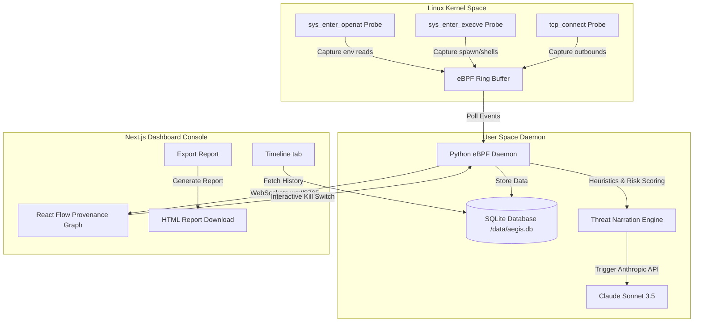

# AEGIS — eBPF Supply Chain Attack Detector

```text
    _     _____ ____ ___ ____  
   / \   | ____/ ___|_ _/ ___| 
  / _ \  |  _| | |  _ | |\___ \ 
 / ___ \ | |___| |_| || | ___) |
/_/   \_\|______\____|___|____/ 
```

### eBPF-Powered Supply Chain Runtime Intrusion Detection & Mitigation System
[](https://github.com/mr-umar-ahmed/Aelfra-Aegis/actions)
[](https://opensource.org/licenses/MIT)
[](#tech-stack)

---

## What is Aegis?

Aegis is an open-source, kernel-level runtime guard designed to detect and block supply chain attacks in real-time. By leveraging eBPF (Extended Berkeley Packet Filter) probes attached directly inside the Linux kernel, Aegis intercepts critical system calls—such as file opens, process executions, and TCP network connections. This approach allows security teams to identify malicious activities, such as exfiltrating `.env` credentials, running unauthorized shells, or initiating cryptomining connections, directly at the OS level without any modification to application code.

Traditional static analysis scanners look for known vulnerabilities inside dependency lockfiles, failing to flag sophisticated Zero-Day attacks or typosquatted packages containing dynamic postinstall execution chains. Aegis runs alongside package installations, analyzing process behaviors, correlating multi-step attack patterns, generating plain-English threat narratives using Claude Sonnet, and offering an immediate runtime "Kill Switch" to terminate malicious processes instantly.

---

## System Architecture



---

## Comparison Matrix

| Feature | Aegis | Falco | Tracee |
| :--- | :--- | :--- | :--- |
| **Detection Method** | eBPF Kernel Probes (C) | eBPF / Kernel Module | eBPF Kernel Probes |
| **Config Language** | Dynamic Python Heuristics | Static YAML Rules | Go / Signature Rules |
| **Visualization** | Interactive React Flow Graph | CLI / External Dashboard | CLI / JSON Stream |
| **CI/CD Integration** | GitHub Actions Workflow | External Plugins | Integration needed |
| **AI Narration** | 3-Sentence Claude Threat Narratives | None (Structured Logs) | None (Structured Logs) |
| **Overhead** | Very Low (< 1% CPU overhead) | Low (Varies with rules) | Low (Varies with rules) |

---

## Attack Coverage

| Attack Type | Description | Real-World Example / Incident |
| :--- | :--- | :--- |
| **`CRED_THEFT`** | Reads sensitive files (e.g., `~/.env`, `~/.aws/credentials`) and attempts exfiltration. | Codecov Bash Uploader Hack |
| **`REVERSE_SHELL`** | Opens a shell listener or pipes a socket process stream to `/bin/bash`. | SolarWinds Orion Backdoor |
| **`CRYPTOMINER`** | Spawns heavy CPU loop threads and connects to standard mining pool ports. | Typo-squatted malicious miners |
| **`TYPOSQUATTER`** | Installs packages with close edit distances mimicking common modules (e.g., `lodsh`). | `cross-env` Typosquat Incident |

---

## Quick Start

Get Aegis up and running in 5 simple commands:

```bash
# 1. Clone the repository and install dependency scan dependencies
git clone https://github.com/mr-umar-ahmed/Aelfra-Aegis.git && cd Aelfra-Aegis

# 2. Setup your local environment credentials for AI Narration and AbuseIPDB
cp .env.example .env && nano .env

# 3. Start the Next.js Web Dashboard
cd dashboard && npm install && npm run dev

# 4. Start the eBPF Daemon (requires sudo on Linux; falls back to Mock Mode on Windows/macOS)
cd ../ebpf && sudo python3 daemon.py

# 5. Run the offline Aegis CLI Dependency Scanner
python3 cli/aegis-scan.py simulator/attacks/cred-theft/package.json
```

---

## Modules Built

1. **Module A (Core Sensor)**: eBPF C probes capturing `openat`, `execve`, and `connect` syscalls.
2. **Module B (Exfiltration Engine)**: Outbound socket tracking correlated against AbuseIPDB databases.
3. **Module C (Baseline Engine)**: Percentile-based risk scoring (0-100) mapped against 10 clean npm packages.
4. **Module D (CLI & Actions)**: Sandbox CLI wrapper run inside Docker alongside GitHub Actions CI pipeline.
5. **Module E (AI Narrator)**: Live Anthropic integration converting event tables to plain-English narratives.
6. **Module F (Attack Library)**: Mock-ready scripts covering 4 common malicious supply chain patterns.
7. **Module G (Database & Export)**: Built-in SQLite event indexing with dynamic client-side HTML report export.

---

## Interview Deep-Dives

Here are 8 deep-dive technical questions and answers summarizing the design constraints of Aegis:

#### 1. Why `sys_enter_openat` and not `sys_enter_read`?
Monitoring read calls introduces prohibitive overhead due to high volume. Monitoring `openat` flags the target file when opened, letting us evaluate intent without degrading system-wide read throughput.

#### 2. What is a BPF ring buffer and why is it better than the older perf buffer?
The ring buffer is a single queue shared across all CPUs, resolving memory fragmentation and guaranteeing global event ordering. It replaces the perf buffer's per-CPU pools which drop bursts of events.

#### 3. What is the difference between a kprobe and a tracepoint?
`kprobes` are dynamic hooks that can attach to almost any kernel function, making them fragile to version updates. `tracepoints` are static hooks hardcoded in the kernel source, making them highly stable.

#### 4. What is BTF (BPF Type Format) and why does it matter?
BTF encodes type info and struct layouts into the kernel. It allows eBPF tools to remain portable, adjusting struct offsets dynamically during runtime (CO-RE: Compile Once - Run Everywhere).

#### 5. What overhead does an eBPF probe add?
Generally under 1% CPU overhead. The hook runs entirely in-kernel with highly-optimized BPF bytecode before passing execution control back to user-space, avoiding context switch overhead.

#### 6. How does the kernel verifier work?
The verifier performs static analysis to ensure the program cannot crash or lock up the kernel. It checks that branches terminate, code does not read uninitialized stack memory, and arrays are safe from buffer overflows.

#### 8. How is Aegis different from Falco?
Falco uses static YAML rulesets to alert on anomalies. Aegis creates a live visual provenance graph, links network calls directly back to their parent process trees, and enables dynamic process killing.

#### 8. How does the kill switch work in a secure manner?
The client issues a WebSocket `kill` request. The Python daemon validates the PID corresponds to an active tracked thread in our SQLite store and triggers `os.kill(pid, SIGKILL)` in user-space, preventing execution hijacking.
