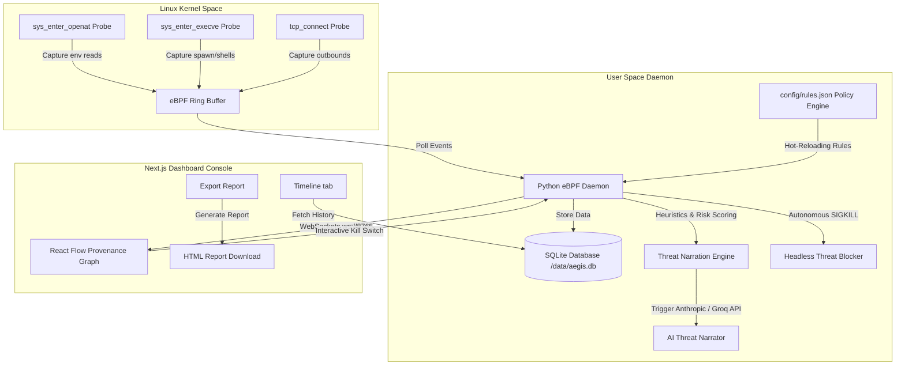

# AEGIS — eBPF Supply Chain Attack Detector

```text
    _     _____ ____ ___ ____  
   / \   | ____/ ___|_ _/ ___| 
  / _ \  |  _| | |  _ | |\___ \ 
 / ___ \ | |___| |_| || | ___) |
/_/   \_\|______\____|___|____/ 
```

### eBPF-Powered Supply Chain Runtime Intrusion Detection & Autonomous Defense
[](https://github.com/mr-umar-ahmed/Aelfra-Aegis/actions/workflows/aegis-scan.yml)
[](https://opensource.org/licenses/MIT)
[](#tech-stack)
[](AEGIS_MASTER_GUIDE.md)

> 📖 **Comprehensive System Blueprint**: For the complete all-in-one technical manual covering the problem statement, technology stack, competitive comparisons, architecture diagrams, all 11+ features, and enterprise deployment guides, read [**`AEGIS_MASTER_GUIDE.md`**](AEGIS_MASTER_GUIDE.md).

---

## What is Aegis?

Aegis is an open-source, kernel-level runtime guard designed to detect and block supply chain attacks in real-time. By leveraging eBPF (Extended Berkeley Packet Filter) probes attached directly inside the Linux kernel, Aegis intercepts critical system calls—such as file opens, process executions, and TCP network connections. This approach allows security teams to identify malicious activities, such as exfiltrating `.env` credentials, running unauthorized shells, or initiating cryptomining connections, directly at the OS level without any modification to application code.

Traditional static analysis scanners look for known vulnerabilities inside dependency lockfiles, failing to flag sophisticated Zero-Day attacks or typosquatted packages containing dynamic postinstall execution chains. Aegis runs alongside package installations, analyzing process behaviors, correlating multi-step attack patterns with a hot-reloading JSON policy engine, and offering autonomous runtime blocking via `SIGKILL` without requiring human intervention.

---

## System Architecture



---

## Daemon Execution Modes

The Aegis daemon supports three distinct operational modes tailored for development, production CI/CD pipelines, and compliance auditing:

```bash
# 1. Interactive Mode (Default) — Starts WebSocket server for Next.js dashboard UI
python3 daemon/daemon.py --mode=interactive

# 2. Headless Mode (Autonomous CI/CD Guard) — Automatically kills high-confidence threats (>= 90%)
python3 daemon/daemon.py --mode=headless --threshold=90

# 3. Audit Mode (Passive Compliance Log) — Logs all matched events to data/audit/*.jsonl without killing
python3 daemon/daemon.py --mode=audit
```

---

## Custom Detection Rules

Aegis uses a declarative, hot-reloading policy engine located at `config/rules.json`. The daemon watches this file using file mtime checks and reloads rules automatically every 5 seconds without requiring a restart.

### Rule Structure

Rules support single-event matching (`file`, `exec`, `network`) and temporal sequence correlation (`chain`).

```json
{
  "id": "CRED_001",
  "name": "Credential File Access",
  "description": "Process accessed a known credential file path",
  "severity": "CRITICAL",
  "mitre_technique": "T1552.001",
  "event_type": "file",
  "conditions": {
    "fname_contains_any": [".env", ".aws/credentials", ".ssh/id_rsa"],
    "comm_not_in": ["vim", "cat", "nano", "grep", "less"]
  },
  "action": "alert",
  "confidence": 85
}
```

### Example: Adding a PyPI Package Postinstall Hook Detector

To detect malicious PyPI packages executing child shell scripts during `pip install`, add the following rule to `config/rules.json`:

```json
{
  "id": "PYPI_001",
  "name": "PyPI Package Postinstall Shell Spawn",
  "description": "pip spawned unexpected shell reconnaissance during package build",
  "severity": "HIGH",
  "mitre_technique": "T1059.006",
  "event_type": "exec",
  "conditions": {
    "parent_comm_in": ["pip", "pip3", "python", "python3"],
    "fname_contains_any": ["setup.py", "bash", "sh", "curl", "wget", "whoami"]
  },
  "action": "kill",
  "confidence": 92
}
```

---

## Comparison Matrix

| Feature | Aegis | Falco | Tracee |
| :--- | :--- | :--- | :--- |
| **Detection Method** | eBPF Kernel Probes (C) | eBPF / Kernel Module | eBPF Kernel Probes |
| **Config Language** | JSON Policy Rules with Hot-Reload | Static YAML Rules | Go / OPA Signatures |
| **Autonomous Blocking** | Built-in Headless SIGKILL (< 50ms) | Requires FalcoSidekick | Requires separate agent |
| **Visualization** | Interactive React Flow Graph | CLI / External Dashboard | CLI / JSON Stream |
| **CI/CD Integration** | Standalone CLI + GitHub Actions | External Plugins | Integration needed |
| **AI Narration** | Plain-English AI Threat Narratives | None (Structured Logs) | None (Structured Logs) |
| **Overhead** | Very Low (< 1% CPU overhead) | Low (Varies with rules) | Low (Varies with rules) |

---

## Quick Start

```bash
# 1. Clone the repository
git clone https://github.com/mr-umar-ahmed/Aelfra-Aegis.git && cd Aelfra-Aegis

# 2. Setup your local environment
cp .env.example .env

# 3. Start the Next.js Web Dashboard
cd dashboard && npm install && npm run dev

# 4. Start the eBPF Daemon (Interactive Mode)
sudo python3 daemon/daemon.py --mode=interactive

# 5. Run the offline Aegis CLI Dependency Scanner (Headless Mode)
python3 cli/aegis-scan.py simulator/attacks/cred-theft/package.json
```

---

## Modules Built

1. **Module A (Core Sensor)**: eBPF C probes capturing `openat`, `execve`, and `connect` syscalls.
2. **Module B (Exfiltration Engine)**: Outbound socket tracking correlated against AbuseIPDB databases.
3. **Module C (Baseline Engine)**: Percentile-based risk scoring (0-100) mapped against 10 clean npm packages.
4. **Module D (CLI & Actions)**: Sandbox CLI wrapper run inside Docker alongside GitHub Actions CI pipeline.
5. **Module E (AI Narrator)**: Live AI integration converting event tables to plain-English narratives.
6. **Module F (Attack Library)**: Mock-ready scripts covering 4 common malicious supply chain patterns.
7. **Module G (Database & Export)**: Built-in SQLite event indexing with dynamic client-side HTML report export.
8. **Industry Upgrade 1 (Policy Rule Engine)**: Declarative JSON policy engine with MITRE techniques and hot-reload.
9. **Industry Upgrade 2 (Headless Auto-Block)**: Autonomous CI/CD threat blocking and passive audit compliance.
